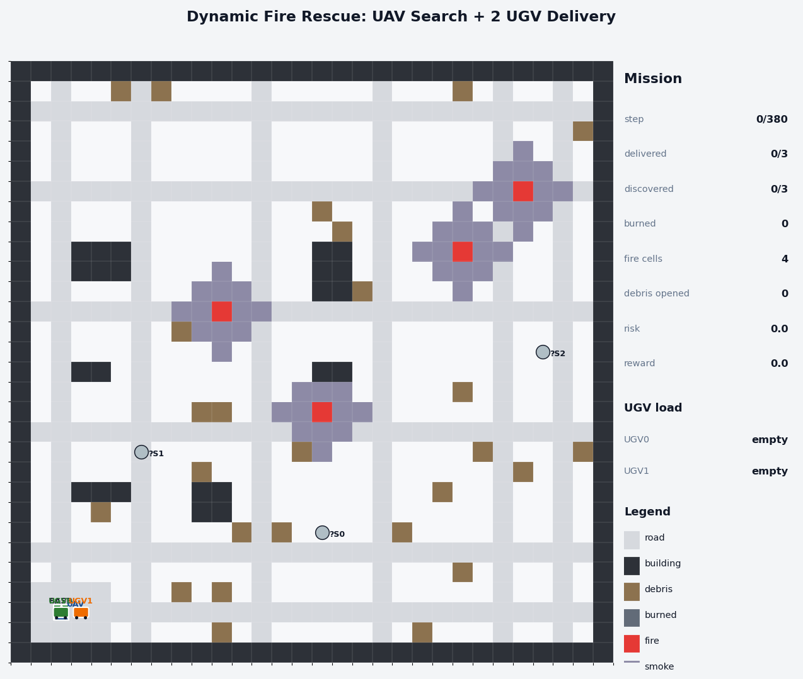
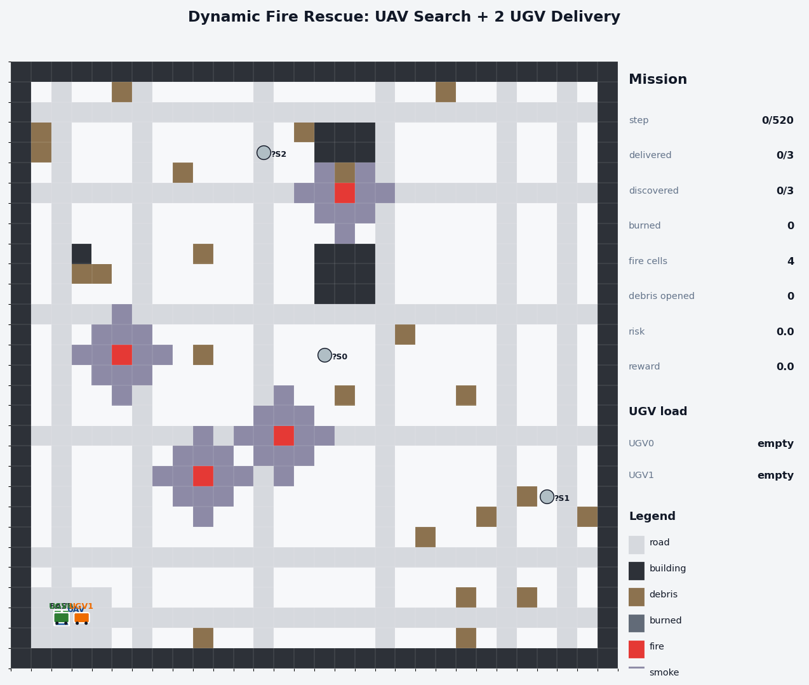
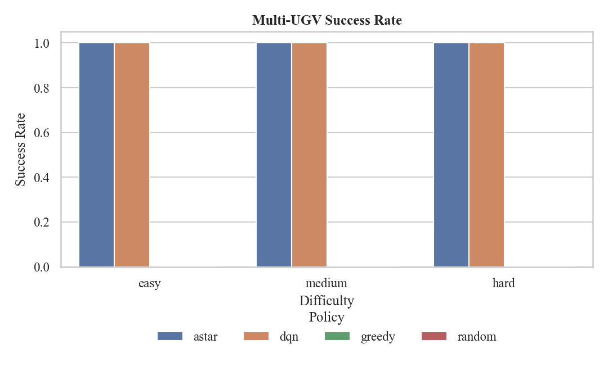
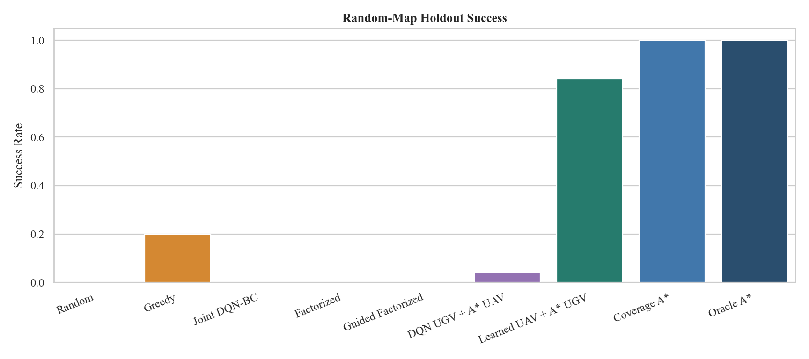
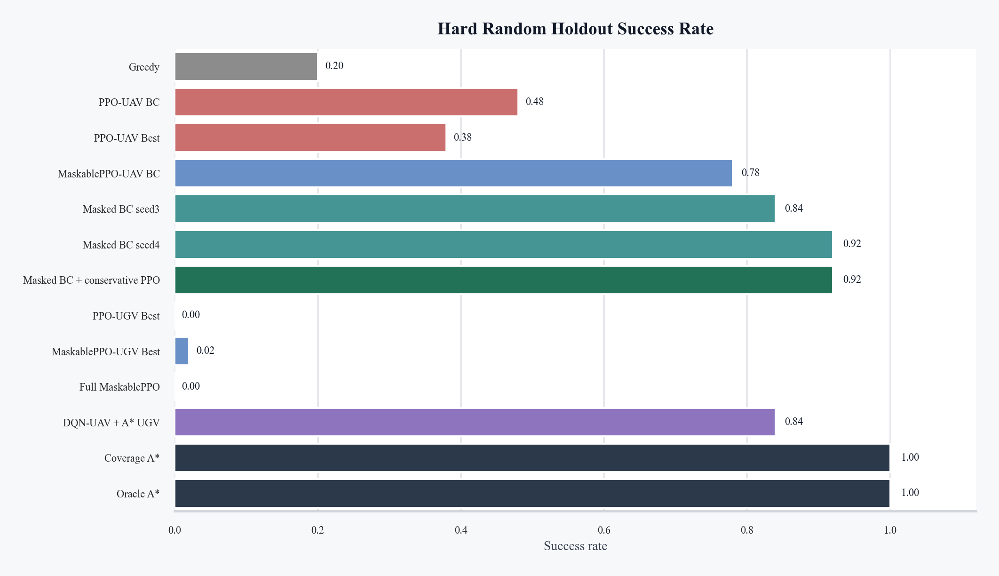
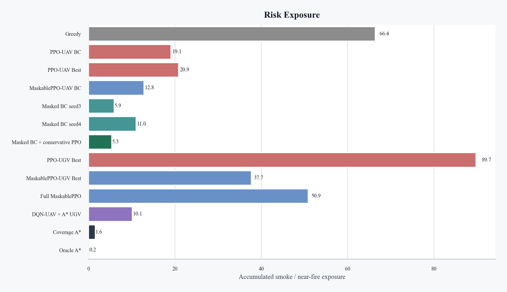
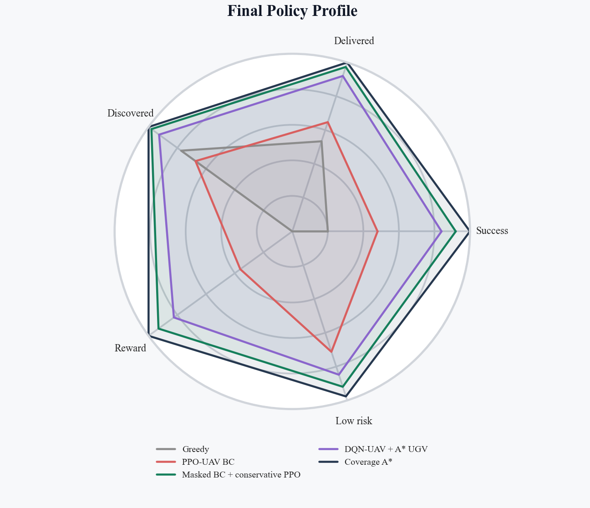
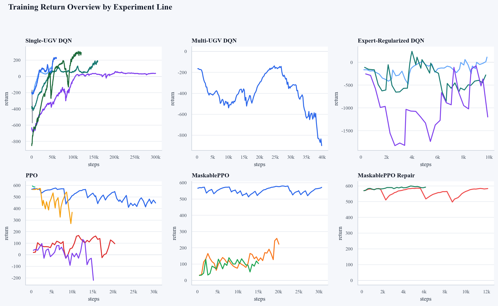

# wildfire rescue多智能体强化学习实验

本项目研究动态wildfire环境中的空地协同搜索与救援任务。智能体由无人机和地面无人车组成：无人机负责搜索并发现幸存者，地面无人车负责前往已发现目标、完成救援并返回基地。项目实现了规则规划、DQN、因子化 DQN、PPO、MaskablePPO 以及学习策略与 A* 规划混合的多条实验路线。

## 核心可视化展示

下面只展示最能代表实验结论的少量结果。完整 CSV、图表和视频路径见下一节。

### 策略演示

| 多 UGV 固定 Hard 地图：DQN-BC 完成救援 | 随机 Hard 地图：MaskablePPO-UAV + Coverage A* 成功案例 |
| --- | --- |
|  |  |

### 最终结果图表

| 固定地图多 UGV 成功率 | 随机 Hard 地图泛化成功率 |
| --- | --- |
|  |  |

| MaskablePPO 最终成功率 | MaskablePPO 风险暴露 | 最终策略雷达图 |
| --- | --- | --- |
|  |  |  |

### 训练过程概览



## 实验结果在哪里看

优先查看下面这些已上传到仓库的结果文件。

| 内容 | 路径 | 说明 |
| --- | --- | --- |
| 多 UGV 固定地图总表 | [`outputs/eval/metrics_csv/multi_summary_all.csv`](outputs/eval/metrics_csv/multi_summary_all.csv) | Easy、Medium、Hard 三个固定地图上的 A*、DQN-BC、Greedy、Random 对比 |
| 随机 Hard 地图泛化诊断 | [`outputs/eval/metrics_csv/multi_generalization_diagnosis_summary.csv`](outputs/eval/metrics_csv/multi_generalization_diagnosis_summary.csv) | 联合 DQN、因子化 DQN、混合策略、Coverage A*、Oracle A* 对比 |
| MaskablePPO 最终对比 | [`outputs/eval/metrics_csv/maskable_ppo_generalization_summary.csv`](outputs/eval/metrics_csv/maskable_ppo_generalization_summary.csv) | PPO、MaskablePPO、Masked BC、保守微调与规划上界对比 |
| PPO 诊断结果 | [`outputs/eval/metrics_csv/ppo_generalization_summary.csv`](outputs/eval/metrics_csv/ppo_generalization_summary.csv) | PPO-UAV、PPO-UGV、Full PPO 的随机 Hard 地图结果 |
| 单 UGV 汇总结果 | [`outputs/eval/metrics_csv/summary_all.csv`](outputs/eval/metrics_csv/summary_all.csv) | 单 UGV DQN 与基线方法对比 |

主要图表在这些目录中：

| 图表目录 | 说明 |
| --- | --- |
| [`outputs/figures/multi_ugv/`](outputs/figures/multi_ugv/) | 多 UGV 固定地图实验图表 |
| [`outputs/figures/multi_ugv/generalization/`](outputs/figures/multi_ugv/generalization/) | 随机 Hard 地图泛化实验图表 |
| [`outputs/figures/multi_ugv/maskable_ppo/`](outputs/figures/multi_ugv/maskable_ppo/) | MaskablePPO 修复实验图表 |
| [`outputs/figures/multi_ugv/ppo/`](outputs/figures/multi_ugv/ppo/) | PPO 诊断实验图表 |
| [`outputs/figures/training_curves/`](outputs/figures/training_curves/) | 训练曲线与综合训练阶段对比 |

更多演示视频在 [`outputs/videos/`](outputs/videos/)：

- `multi_dqn_easy_demo.gif`、`multi_dqn_medium_demo.gif`、`multi_dqn_hard_demo.gif`：多 UGV 固定地图 DQN-BC 策略演示。
- `learned_uav_astar_ugv_hard_random_guided_seed1000.gif`：学习型 UAV 与 A* UGV 的随机 Hard 地图混合策略演示。
- `maskppo_uav_trueft_success_seed1000.gif`：MaskablePPO-UAV 加 Coverage A* UGV 的成功案例。
- `maskppo_uav_trueft_failure_seed1001.gif`：同一最终策略的失败案例，便于分析边界情况。
- `ppo_uav_bc_success_seed1000.gif`、`ppo_uav_bc_failure_seed1001.gif`：普通 PPO-UAV 的成功与失败案例。

模型权重和训练日志没有上传到 GitHub。它们会在本地运行脚本后生成到 `outputs/models/` 和 `outputs/logs/`，并被 `.gitignore` 排除。

## 核心实验结论

固定地图上的多 UGV 任务中，DQN-BC 可以复现 A* 专家轨迹并稳定完成救援：

| 难度 | 方法 | 成功率 | 平均奖励 | 平均步数 | 平均送达人数 |
| --- | --- | ---: | ---: | ---: | ---: |
| Easy | DQN-BC | 1.00 | 415.20 | 92.00 | 2.00 |
| Medium | DQN-BC | 1.00 | 526.42 | 86.00 | 3.00 |
| Hard | DQN-BC | 1.00 | 544.17 | 104.00 | 3.00 |

随机 Hard 地图上，纯端到端或全神经策略泛化较弱。表现更可靠的是分层混合方法，即学习型 UAV 搜索策略加 A* 地面救援规划：

| 方法 | 成功率 | 平均奖励 | 平均步数 | 平均送达人数 | 风险暴露 |
| --- | ---: | ---: | ---: | ---: | ---: |
| Joint DQN-BC | 0.00 | -1744.34 | 492.80 | 0.14 | 28.09 |
| Guided Factorized DQN | 0.00 | 116.13 | 512.48 | 0.48 | 9.08 |
| Learned UAV + A* UGV | 0.84 | 517.23 | 266.22 | 2.76 | 10.09 |
| Masked BC + conservative PPO | 0.92 | 561.10 | 236.66 | 2.92 | 5.35 |
| Coverage A* | 1.00 | 589.50 | 203.66 | 3.00 | 1.56 |
| Oracle A* | 1.00 | 568.05 | 134.92 | 3.00 | 0.18 |

最终可以概括为：

- 低层联合动作空间较大，直接训练完整三智能体控制器不稳定。
- 单纯 PPO 微调会破坏行为克隆得到的初始策略，普通 PPO 不是本任务的最优路线。
- 动作掩码和 Masked BC 明显提升 PPO-UAV 分支。
- 最强学习组件是 UAV 搜索策略；UGV 长程接送和返航更适合由显式安全路径规划处理。
- Coverage A* 和 Oracle A* 是规划上界，不代表纯学习方法，但能帮助判断学习策略距离可达上限还有多远。

## 项目任务

环境是一个带动态火势、烟雾、障碍和幸存者的网格世界。任务目标是让多智能体团队在危险扩散前完成以下流程：

```text
UAV 搜索区域 -> 发现幸存者 -> UGV 前往救援 -> UGV 返回基地
```

单 UGV 版本使用中心化 DQN 控制联合动作：

```text
joint_action = uav_action * 5 + ugv_action
```

多 UGV 版本采用 `1 UAV + 2 UGV`，联合动作空间为：

```text
5^3 = 125
```

## 代码结构

```text
configs/                       实验配置文件
scripts/                       训练、评估、渲染和绘图入口
src/fire_rescue_rl/envs/        野火救援环境、地图生成、渲染、PPO 包装器
src/fire_rescue_rl/agents/      A*、Greedy、Random、因子化策略等智能体
src/fire_rescue_rl/utils/       指标、配置、随机种子、视频与绘图工具
outputs/eval/metrics_csv/      已保存的评估 CSV
outputs/figures/               已保存的实验图表
outputs/videos/                已保存的演示视频
```

## 环境安装

推荐使用课程要求的 Conda 环境名 `RLearning`：

```powershell
conda activate RLearning
pip install -r requirements.txt
```

也可以用 `conda run` 直接执行脚本：

```powershell
conda run -n RLearning python scripts/check_env.py
```

主要依赖包括 `gymnasium`、`stable-baselines3`、`sb3-contrib`、`torch`、`numpy`、`pandas`、`matplotlib`、`seaborn`、`imageio` 和 `opencv-python`。

## 常用运行命令

检查单 UGV 环境：

```powershell
conda run -n RLearning python scripts/check_env.py
```

检查多 UGV 环境：

```powershell
conda run -n RLearning python scripts/check_multi_env.py
```

复现多 UGV 固定 Hard 地图 DQN-BC 路线：

```powershell
conda run -n RLearning python scripts/train_multi_dqn.py --config configs/env_multi_hard.yaml --seed 0 --timesteps 1 --expert-episodes 0 --bc-episodes 320 --bc-steps 5000 --eval-freq 10000
conda run -n RLearning python scripts/eval_multi_dqn.py --config configs/env_multi_hard.yaml --seed 0 --episodes 30 --include-rl
conda run -n RLearning python scripts/render_multi_policy.py --config configs/env_multi_hard.yaml --agent dqn --seed 0 --format gif --tag multi_dqn_hard_demo
conda run -n RLearning python scripts/plot_multi_all.py
```

复现随机 Hard 地图泛化诊断图：

```powershell
conda run -n RLearning python scripts/plot_generalization_results.py
```

复现 PPO 诊断图：

```powershell
conda run -n RLearning python scripts/plot_ppo_results.py
```

复现 MaskablePPO 最终对比图：

```powershell
conda run -n RLearning python scripts/plot_maskable_ppo_results.py
```

生成训练曲线汇总：

```powershell
conda run -n RLearning python scripts/collect_training_returns.py
conda run -n RLearning python scripts/plot_training_returns.py
```

训练类脚本会重新生成模型和日志，耗时取决于机器配置。若只想查看结果，优先打开 `outputs/eval/metrics_csv/`、`outputs/figures/` 和 `outputs/videos/`。

## 主要脚本说明

| 脚本 | 用途 |
| --- | --- |
| `scripts/train_dqn.py` | 训练单 UGV DQN |
| `scripts/eval_agents.py` | 评估单 UGV Random、Greedy、A*、DQN |
| `scripts/render_demo.py` | 渲染单 UGV 策略演示 |
| `scripts/train_multi_dqn.py` | 训练多 UGV DQN-BC |
| `scripts/eval_multi_dqn.py` | 评估多 UGV DQN 与基线 |
| `scripts/render_multi_policy.py` | 渲染多 UGV 策略演示 |
| `scripts/train_factorized_multi_dqn.py` | 训练因子化多智能体 DQN |
| `scripts/train_multi_ppo.py` | 训练普通 PPO 分支 |
| `scripts/eval_multi_ppo.py` | 评估普通 PPO 分支 |
| `scripts/train_multi_maskable_ppo.py` | 训练 MaskablePPO 分支 |
| `scripts/eval_multi_maskable_ppo.py` | 评估 MaskablePPO 分支 |
| `scripts/plot_multi_all.py` | 绘制固定地图多 UGV 对比图 |
| `scripts/plot_generalization_results.py` | 绘制随机 Hard 泛化对比图 |
| `scripts/plot_ppo_results.py` | 绘制 PPO 诊断图 |
| `scripts/plot_maskable_ppo_results.py` | 绘制 MaskablePPO 最终对比图 |

## 方法路线

项目包含以下实验路线：

- 规则基线：Random、Greedy、A*、Coverage A*、Oracle A*。
- 单 UGV DQN：用于验证基础空地协同救援流程。
- 多 UGV DQN-BC：使用 A* 专家轨迹进行行为克隆，解决固定地图任务。
- 因子化 DQN：尝试降低联合动作空间难度，用于随机 Hard 地图泛化诊断。
- PPO：作为独立强化学习路线，包含 UAV、UGV 和完整联合控制三种包装器。
- MaskablePPO：引入动作掩码，减少非法动作采样，并配合 Masked BC 和保守微调。
- 分层混合策略：学习策略负责 UAV 搜索，A* 负责 UGV 安全救援路径规划。

## 阅读建议

快速了解项目时，建议按这个顺序看：

1. 先看 README 顶部的核心动图和图表，快速理解最终策略效果。
2. 打开 [`outputs/eval/metrics_csv/maskable_ppo_generalization_summary.csv`](outputs/eval/metrics_csv/maskable_ppo_generalization_summary.csv)，看最终随机 Hard 地图对比。
3. 打开 [`outputs/eval/metrics_csv/multi_generalization_diagnosis_summary.csv`](outputs/eval/metrics_csv/multi_generalization_diagnosis_summary.csv)，理解为什么最终选择分层混合路线。
4. 需要更多案例时，再进入 [`outputs/videos/`](outputs/videos/) 和 [`outputs/figures/`](outputs/figures/) 查看完整结果。
